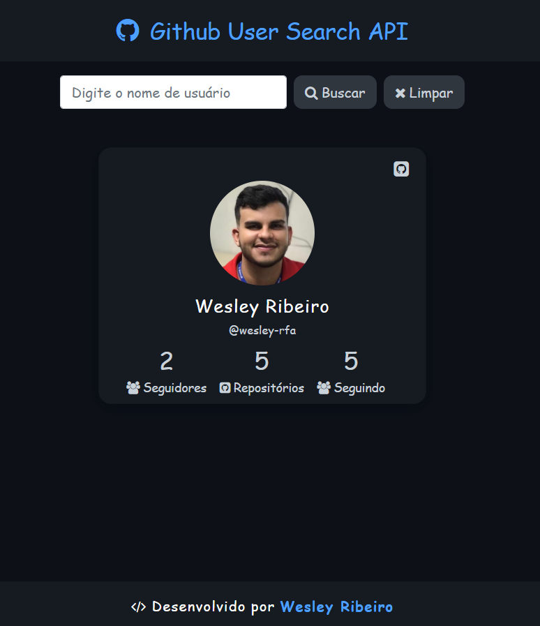

## API Github User 
      

## How to use
**1** - Faça um clone do repositório para sua máquina

    git clone https://github.com/wesley-rfa/Consumindo-API-Github.git
**2** - Abra a index.html 

   ou

*Acesse*: https://wesley-rfa.github.io/Consumindo-API-Github/

## Implementação

A ideia do projeto é acessar a API do GitHub utilizando requisições assíncronas com JQuery e AJAX.

Na implementação a estilização foi feita utilizando o pré-processador SASS, CSS e o BootStrap. 

Com o JavaScript foi utilizado o JQquery e AJAX para requisições assíncronas.

## Funcionalidades

**1** - Através do campo de busca solicitar a API o usuário digitado.

    1.1 - Caso o usuário digitado não seja encontrado é exibido um Modal com a mensagem de usuário não encontrado.
    
**2** - Ao encontrar o usuário é mostrado as principais informações em um Card principal, que contêm o nome, nome de usuário, quantidade de seguidores, repositórios e seguindo.

**3** - Ao clicar no Card abre um modal com informações mais detalhadas sobre o perfil e clicando no modal abre uma nova guia com o respectivo perfil no GitHub.

**4** - A medida que o usuário busca, os Cards se ajustam automáticamente ao espaço da tela.

**5** - É possível limpar todas as buscas com o botão de limpar.

